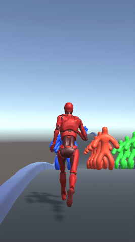

# Endless Runner

- [Docs Ref](https://docs.google.com/document/d/1ozKamX1teAbwxqOpEU_CuRYcMWSM6VP-/edit)
- [Google Play Ref](https://play.google.com/store/apps/details?id=com.hypercarrot.giantrush)

## Description 

Engless runner with color change.


## Technical Task

- Make Game
- Improve it
- [Link](fuckYou.com)


Endless runner whrer character can become **Bigger** or *smaller*
💕👍😎😃✨


## Progress

### V 0.1



## Feature List ✅⚜

### A Prioriy

- [ ] Start/End 
- [ ] WebGL build
- [x] **Random Level Generation**
- [x] Github web page
- [x] Charcater Infinit Running 
- [x] Character Move Left/Right
- [x] Size Changing System


### B Priority

- [ ] Die Feature `score==0`

<details> 
 <summary>Code</summary>

```csharp
void Update(){
	if(score<0)
		Die();
	else	
		KeepRunning();
}
```
</details> 

- [ ] Swipe Drag
- [ ] End Game
- [ ] Score counting
- [x] Grow Limition


### C Priority

## Bugs🐞 

- [ ] Infinit Running
- [ ] Size changing
- [ ] Grow Limition


## Technical ditaisl 

`CharacterForwardController.cs`	 - Is a class I use to auto run forward

```csharp
void ILoveGame(){
	GamWork();
	for(int i = 0; i<Enough;I++){
	GameCycle();
	}
}

```

