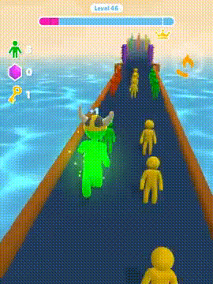

# Endless Runner

- [Docs Ref](https://docs.google.com/document/d/1ozKamX1teAbwxqOpEU_CuRYcMWSM6VP-/edit)
- [Google Play Ref](https://play.google.com/store/apps/details?id=com.hypercarrot.giantrush)

## Description 

Engless runner with color change.


## Technical Task

- Make Game
- Improve it
- [Link](fuckYou.com)


Endless runner whrer character can become **Bigger** or *smaller*
💕👍😎😃✨




## Feature List

- [x] Running 
- [ ] Swipe Drag

## Bugs🐞 

- [ ] Infinit Running


## Technical ditaisl 

`CharacterForwardController.cs`	 - Is a class I use to auto run forward

```csharp
void ILoveSuck(){
	SuckSomeDick();
	for(int i = 0; i<EnoughSucking;I++){
	Suck();
	}
}

```

